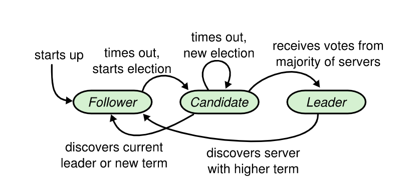
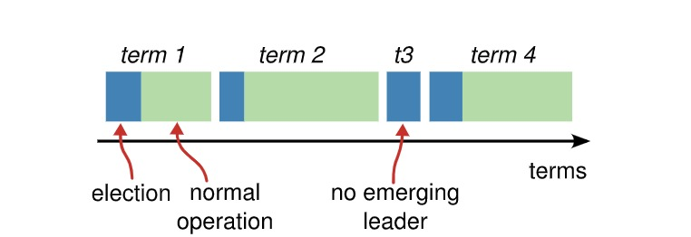

### 一、Raft协议简介

* Raft 是一种为了管理复制日志的一致性协议

* 复制状态机概念，复制状态机是指每个状态机或系统如果初始状态一致，然后接受的改变状态的命令也一致，最后产生的结果状态也是相同。
 
### 二、Raft选举过程

* 选举过程图1（单个节点视角）



* 选举过程图2（整体视角）



### 三、Raft日志复制流程

* 日志格式：term + index + cmd + type


* 请求处理整体流程


* 请求处理详细流程（重点）


注：这里7. commit log 应该是在5. commit之后，但是因为commit策略的原因有一定延迟，所以从日志上看是在回复客户端以后

### 四、Raft协议动画演示

* Raft系统运行可视化1 [http://thesecretlivesofdata.com/raft](http://thesecretlivesofdata.com/raft/)

* Raft系统运行可视化2 [https://raft.github.io/#implementations](https://raft.github.io/#implementations)

### 五、hashicorp/raft源码讲解

* hashicorp/raft库 [https://github.com/hashicorp/raft](https://github.com/hashicorp/raft)

* raft启动流程

* raft监听事件

### 六、运行hashicorp/raft库搭建的简单kv服务

* 编译：go build -mod vendor

* 启动node1: ./raft-demo --http_addr=127.0.0.1:7001 --raft_addr=127.0.0.1:7000 --raft_id=1 --raft_cluster=1/127.0.0.1:
  7000,2/127.0.0.1:8000,3/127.0.0.1:9000

* 启动node2: ./raft-demo --http_addr=127.0.0.1:8001 --raft_addr=127.0.0.1:8000 --raft_id=2 --raft_cluster=1/127.0.0.1:
  7000,2/127.0.0.1:8000,3/127.0.0.1:9000

* 启动node3: ./raft-demo --http_addr=127.0.0.1:9001 --raft_addr=127.0.0.1:9000 --raft_id=3 --raft_cluster=1/127.0.0.1:
  7000,2/127.0.0.1:8000,3/127.0.0.1:9000

* set请求：curl http://127.0.0.1:7001/set?key=test_key&value=test_value

* get请求：curl http://127.0.0.1:7001/get?key=test_key

### 七、调试场景

##### 选举变化相关

1. 集群启动后，follower等待一个随机election timeout时间变成candidate，然后发起投票，如果不能获得majority票数，则任期term会一直增加（未pre-vote情况）(branch:
   election-1)

2. 集群启动后，follower等待一个随机election timeout时间变成candidate，然后发起投票，获得majority票数的节点变成leader (branch: election-2)

3. leader选举成功后发送heartbeat保持leader的地位(branch: election-3)

4. leader失去majority节点的heartbeat响应，退回到follower(branch: election-4)

##### 日志复制相关

1. leader接收客户端请求，向集群内所有节点发送复制RPC，所有都正常响应 -> 正常commit，然后apply到状态机，最后返回客户端处理成功(branch: replicate-log-1)

2. leader接收客户端请求，向集群内所有节点发送复制RPC，majority正常响应 -> 正常commit，然后apply到状态机，最后返回客户端处理成功(branch: replicate-log-2)

3. leader接收客户端请求，向集群内所有节点发送复制RPC，少于majority正常响应 -> 不能commit(branch: replicate-log-3)

### 八、收获

* hashicorp/raft源码

* raft选举与日志复制

### 九、QA

纠正：3个节点宕机2个，剩下一个不可用，怎么处理请求的强一致？

答：这个时候服务应该是不可用的，当然如果要强行提供查询的服务，强一致肯定是无法保证的。


### raft-stable.db
```azure
CurrentTerm:2
LastVoteCand: 127.0.0.1:10000
LastVoteTerm: 2
```

### raft-log.db
```
key: 1,value :{Index:1 Term:1 Type:LogConfiguration Data:{Servers:[]} Extensions: AppendedAt:0001-01-01 00:00:00 +0000 UTC}
key: 2,value :{Index:2 Term:3 Type:LogNoop Data:{Servers:[]} Extensions: AppendedAt:2022-01-24 02:52:29.167131 +0000 UTC}
key: 3,value :{Index:3 Term:3 Type:LogCommand Data:{Servers:[]} Extensions: AppendedAt:2022-01-24 02:52:30.7774 +0000 UTC}
key: 4,value :{Index:4 Term:3 Type:LogCommand Data:{Servers:[]} Extensions: AppendedAt:2022-01-24 02:52:30.856799 +0000 UTC}
...
key: 84,value :&{Index:84 Term:2 Type:LogCommand Data:[115 101 116 44 97 43 56 49 44 56 49] Extensions:[] AppendedAt:2022-01-20 11:02:35.959754 +0800 CST m=+8.364670689}
key: 85,value :&{Index:85 Term:2 Type:LogCommand Data:[115 101 116 44 97 43 56 50 44 56 50] Extensions:[] AppendedAt:2022-01-20 11:02:35.998264 +0800 CST m=+8.403179990}
key: 86,value :&{Index:86 Term:2 Type:LogCommand Data:[115 101 116 44 97 43 56 51 44 56 51] Extensions:[] AppendedAt:2022-01-20 11:02:36.036569 +0800 CST m=+8.441484039}
key: 87,value :&{Index:87 Term:2 Type:LogCommand Data:[115 101 116 44 97 43 56 52 44 56 52] Extensions:[] AppendedAt:2022-01-20 11:02:36.075577 +0800 CST m=+8.480490624}
key: 88,value :&{Index:88 Term:2 Type:LogCommand Data:[115 101 116 44 97 43 56 53 44 56 53] Extensions:[] AppendedAt:2022-01-20 11:02:36.113767 +0800 CST m=+8.518679029}
key: 89,value :&{Index:89 Term:2 Type:LogCommand Data:[115 101 116 44 97 43 56 54 44 56 54] Extensions:[] AppendedAt:2022-01-20 11:02:36.153333 +0800 CST m=+8.558243818}
key: 90,value :&{Index:90 Term:2 Type:LogCommand Data:[115 101 116 44 97 43 56 55 44 56 55] Extensions:[] AppendedAt:2022-01-20 11:02:36.192726 +0800 CST m=+8.597637183}
key: 91,value :&{Index:91 Term:2 Type:LogCommand Data:[115 101 116 44 97 43 56 56 44 56 56] Extensions:[] AppendedAt:2022-01-20 11:02:36.232636 +0800 CST m=+8.637545273}
key: 92,value :&{Index:92 Term:2 Type:LogCommand Data:[115 101 116 44 97 43 56 57 44 56 57] Extensions:[] AppendedAt:2022-01-20 11:02:36.246781 +0800 CST m=+8.651689157}
key: 93,value :&{Index:93 Term:2 Type:LogCommand Data:[115 101 116 44 97 43 57 48 44 57 48] Extensions:[] AppendedAt:2022-01-20 11:02:36.275155 +0800 CST m=+8.680062738}
key: 94,value :&{Index:94 Term:2 Type:LogCommand Data:[115 101 116 44 97 43 57 49 44 57 49] Extensions:[] AppendedAt:2022-01-20 11:02:36.314457 +0800 CST m=+8.719363894}
key: 95,value :&{Index:95 Term:2 Type:LogCommand Data:[115 101 116 44 97 43 57 50 44 57 50] Extensions:[] AppendedAt:2022-01-20 11:02:36.354387 +0800 CST m=+8.759292103}
key: 96,value :&{Index:96 Term:2 Type:LogCommand Data:[115 101 116 44 97 43 57 51 44 57 51] Extensions:[] AppendedAt:2022-01-20 11:02:36.393048 +0800 CST m=+8.797952296}
key: 97,value :&{Index:97 Term:2 Type:LogCommand Data:[115 101 116 44 97 43 57 52 44 57 52] Extensions:[] AppendedAt:2022-01-20 11:02:36.431691 +0800 CST m=+8.836593571}
key: 98,value :&{Index:98 Term:2 Type:LogCommand Data:[115 101 116 44 97 43 57 53 44 57 53] Extensions:[] AppendedAt:2022-01-20 11:02:36.471694 +0800 CST m=+8.876595735}
key: 99,value :&{Index:99 Term:2 Type:LogCommand Data:[115 101 116 44 97 43 57 54 44 57 54] Extensions:[] AppendedAt:2022-01-20 11:02:36.510897 +0800 CST m=+8.915797453}
```


### rpcType
```azure
rpcAppendEntries
rpcRequestVote
rpcInstallSnapshot
rpcTimeoutNow
```

### Command Type
```
AppendEntriesRequest
RequestVoteRequest
InstallSnapshotRequest
TimeoutNowRequest
```


### 竞选流程
- con 对每一个启动时制定好的节点进行rpc调用
```azure
req := &RequestVoteRequest{
		RPCHeader:          r.getRPCHeader(),   // 只有协议版本
		Term:               r.getCurrentTerm(), // 当前任期
		Candidate:          r.trans.EncodePeer(r.localID, r.localAddr), // 竞选者，其实就是localAddr
		LastLogIndex:       lastIdx,// 最新的日志索引
		LastLogTerm:        lastTerm,// 当前的任期
		LeadershipTransfer: r.candidateFromLeadershipTransfer, // 在这为false
}
RequestVote(本机的逻辑ID, 本机的通信地址, req, &resp.RequestVoteResponse)
```
- 远端接收rpc调用
  - handleCommand
  - processRPC
  - requestVote

当某个节点得到了大多数的请求，自己就会变成leader,此时再有投票请求到来不会,不会对其投票【除非设置LeadershipTransfer=true】

问题：
  1、集群最初，假设有两个节点都获得大多数投票，都使自身成为了leader？
  
```
在发送心跳的时候,会解决这个问题
if a.Term > r.getCurrentTerm() || r.getState() != Follower {
    r.setState(Follower)
    r.setCurrentTerm(a.Term)
    resp.Term = a.Term
}
```
  2、问什么就算是日志开启了pipeline模式,也是每次都发送一条日志
```
因此每次有日志产生， 会 lastIndex++、调用replicateTo【串行】，也就是不会产生日志积累，也就不会在pipe里同时传输多条日志了
另外、 setNewLogs()函数是具体对AppendEntriesRequest进行日志封装的逻辑
min(nextIndex+uint64(maxAppendEntries)-1, lastIndex)-nextIndex+1 代表了此次请求携带的日志量

另外、在非管道模式下，只要成功发送一次AppendEntriesRequest,就会进入到管道模式。也就说尽可能使用管道模式
```